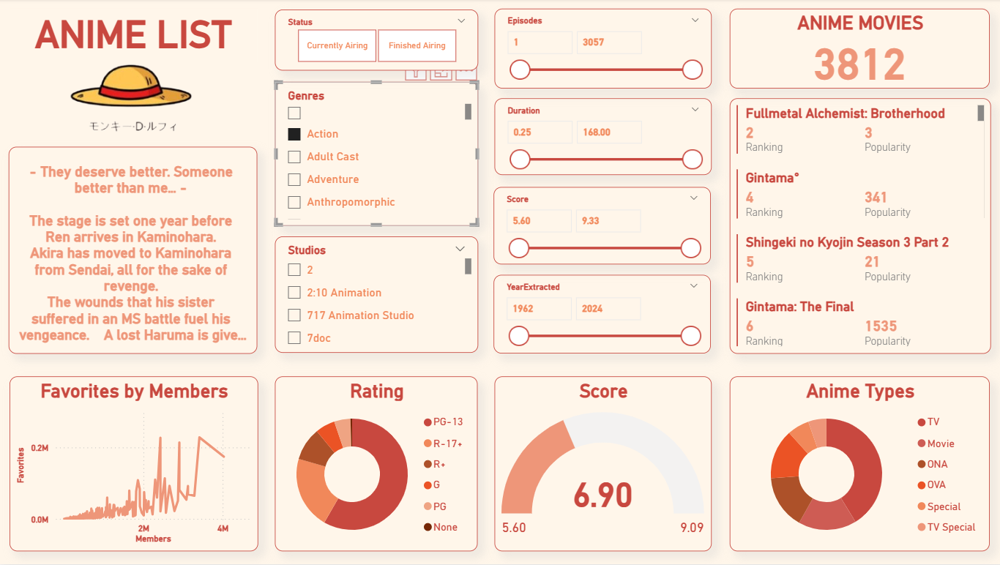

# Hệ thống Quản lý và Đề xuất Anime

Dự án được thực hiện bởi Nhóm 1 trong khuôn khổ học phần **Quản trị Cơ sở Dữ liệu**, với mục tiêu xây dựng một hệ thống **Quản lý và đề xuất Anime** hoàn chỉnh.  
Chúng tôi triển khai dự án theo quy trình chuẩn: từ thu thập dữ liệu thực tế, thiết kế cơ sở dữ liệu quan hệ, xử lý – phân tích dữ liệu, đến xây dựng hệ thống đề xuất trên nền web.

## Mục tiêu dự án

- Cào dữ liệu từ website thực tế: [https://myanimelist.net](https://myanimelist.net)
- Thiết kế hệ thống CSDL quan hệ theo chuẩn 3NF, đảm bảo tính toàn vẹn
- Xây dựng hệ thống đề xuất anime cá nhân hóa dựa trên nội dung và thể loại
- Triển khai dashboard trực quan hóa dữ liệu với Power BI và Tableau
- Áp dụng phân quyền, sao lưu dữ liệu, và triển khai lên giao diện web

## Mô tả

| Tên file | Mô tả |
|----------|-------|
| `QTCCSDL_AnimeList_Data.xlsx` | Dữ liệu Anime được cào từ MyAnimeList và tiền xử lý |
| `QTCCSDL_HeThong_TienXuLy.sql` | Script SQL xử lý dữ liệu, tạo bảng, phân tách quan hệ |
| `QTCCSDL_Dashboard.pbix` | Dashboard trực quan hóa dữ liệu bằng Power BI |
| `QTCCSDL_DeXuatAnime.ipynb` | Notebook Python xây dựng hệ thống đề xuất phim dựa trên nội dung |
| `QTCCSDL_Report.pdf` | Báo cáo chính thức mô tả toàn bộ quá trình triển khai dự án |
| `QTCCSDL_Crawl_Code.ipynb` | Code Python sử dụng cho việc cào dữ liệu từ website |

## Kỹ năng & Công cụ sử dụng

- **Python (Selenium, Requests)** – Web scraping dữ liệu từ trang MyAnimeList
- **SQL Server** – Thiết kế CSDL, phân quyền người dùng, backup và restore
- **Power BI / Tableau** – Trực quan hóa dữ liệu
- **Pandas, Sklearn** – Xử lý dữ liệu và xây dựng hệ thống đề xuất
- **Cosine Similarity + TF-IDF** – Đề xuất phim dựa trên nội dung
- **HTML Template (Flask)** – Giao diện người dùng cho hệ thống

## Dashboard Preview

> Dưới đây là hình ảnh của dashboard
> 

## Các giai đoạn thực hiện

### 🔹 R1. Cào dữ liệu
- Sử dụng Selenium + Requests để thu thập hơn 10.000 dòng dữ liệu anime
- Các trường: Tên phim, Studio, Thể loại, Điểm, Số tập, Mô tả, Thời lượng, Rating, Premiered...

### 🔹 R2. Đưa dữ liệu vào CSDL
- Kết nối Python với SQL Server, lưu dữ liệu đã thu thập vào bảng gốc

### 🔹 R3. Tiền xử lý & thiết kế CSDL
- Làm sạch dữ liệu, chuẩn hóa và phân tách thành các bảng con: `Anime`, `Studio`, `Genres`, `Statistics`, `Rating`, `Premiered`,...
- Áp dụng chuẩn hóa và thiết kế sơ đồ ER/DR

### 🔹 R4. Sao lưu & Phân quyền
- Thiết lập hệ thống **full backup (tháng)** và **differential backup (tuần)**
- Phân quyền theo vai trò: `Admin`, `Data Engineer (DE)`, `Data Analyst (DA)`

### 🔹 R5. Trực quan hóa dữ liệu
- Xây dựng các dashboard về: Thể loại phổ biến, Điểm đánh giá, Số tập, Studio sản xuất,...
- Công cụ sử dụng: **Power BI**, **Tableau**

### 🔹 R6. Xây dựng hệ thống đề xuất
- Áp dụng **TF-IDF** và **Cosine Similarity** để đề xuất phim tương đồng
- Cho phép người dùng nhập tên phim hoặc danh sách yêu thích
- Kết nối CSDL → xử lý truy vấn → xuất kết quả đề xuất
- Giao diện web cơ bản với chức năng login và dashboard đề xuất

## Ghi chú

- Dự án mang tính học thuật, được triển khai để áp dụng kiến thức đã học trong môn Quản trị CSDL.
- Dữ liệu được cào từ nguồn công khai, không sử dụng vào mục đích thương mại.
- Vui lòng trích dẫn nguồn khi sử dụng lại nội dung từ dự án này.

## Giới Thiệu Cá Nhân

Dự án góp phần thực hiện bởi *Trần Thị Minh Ngọc* – sinh viên định hướng theo lĩnh vực Phân tích Dữ liệu và Business Intelligence.  
Mong muốn phát triển trong các vai trò liên quan đến phân tích dữ liệu, xây dựng dashboard, và hỗ trợ ra quyết định kinh doanh dựa trên dữ liệu.

📬 Email: [minhngoc04.work@gmai.com]

